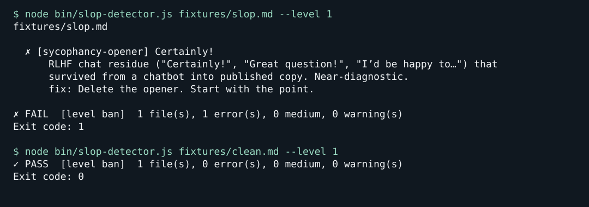

# ai-slop-detector

An agent skill and optional command-line linter that help developers review prose, interfaces, and code comments for empty claims and distracting presentation.

This project combines editorial judgment with deterministic checks. It does not require scans after every edit or ban certain styles unconditionally: necessary safety comments and intentional native UI fonts should remain acceptable during review.



The image shows actual output from the synthetic fixtures below. Regenerate it
with `python3 docs/render-demo.py > assets/demo.svg` (Python 3 and Node required).

## Quick start

Requires Node.js 20+ and Git. No dependency installation is needed for a local scan.

```bash
git clone https://github.com/asabirov/ai-slop-detector-skill.git
cd ai-slop-detector-skill
node bin/slop-detector.js fixtures/slop.md --level 1
node bin/slop-detector.js fixtures/clean.md --level 1
```

The first scan reports `sycophancy-opener` and exits **1**. That failure is expected:
it catches a chatbot greeting in the sample. The second scan reports `PASS` and
exits **0**. Replace the fixture path with a file or directory to scan your work.

The CLI is **not published to npm**. The public registry returned 404 for
`@apliteni/slop-detector` on 2026-09-23. Run from this clone or use the GitHub-based
`npx` commands below.

## Why it exists

AI-assisted drafts can keep chatbot greetings, vague claims, and comments that simply describe the code. The skill identifies specific problems in a finished artifact. The optional CLI finds repeatable patterns across files and provides stable exit codes for CI. Neither tool can prove who wrote the work.

## Using the skill

Ask your agent to “check this README for AI slop” after making the skill available
in its skill directory. The skill makes one focused pass and reports the passage,
the reader's problem and a specific correction. It preserves useful technical
detail and does not rewrite for readability; use a separate editing pass for that.

Read [SKILL.md](SKILL.md) for the workflow. The skill does not automatically run a
command, install dependencies or review untouched files. Use the CLI when
requested, required by the repository or useful for a batch scan. Editorial
judgment does not waive an existing CI gate.

The editorial UI review flags boxed selection in dropdowns: an accent-filled
selected row with a matching rounded border competing with the search field’s
focus outline. It recommends a quiet selection cue while preserving visible
keyboard focus. This is rendered-context guidance in the skill, not a new CLI
rule; static declarations alone cannot establish which control has focus.

## What it does today

Three rule packs over one engine.

- **Visual** reads markup and the CSS a page applies, including stylesheets it
  links from disk. Catches fake protocol URIs, monospace used as decoration,
  emoji headings, gradients, glow shadows, glass surfaces, nested cards,
  oversized stats, motion and repeated layout defaults. Native font stacks and
  numeric table data are allowed.
- **Text** reads visible prose plus the attributes a person actually reads
  (`title`, `alt`, `placeholder`, `aria-label`, `data-tip`, the meta
  description). Catches "not just X, but Y", hedge openers, sycophancy residue,
  clustered inflated vocabulary.
- **Comments** reads source files. Catches the design document an agent files
  into a code comment because the project gave it nowhere else to write one.
  `comment-chaptered` joins blocks separated by exactly one blank line, with
  no code between them: 8+ comment lines require two headings or interior
  dividers in total to fail level 1. A block of 8+ lines with one signal
  still fails on its own, even inside a joined run.
  One title in a joined run is a label; two chapter signals make chapters.
  Blank separators do not count toward length; individual block frames stay
  exempt. Essay and ratio measurements are unchanged.

Code is not prose. Fenced blocks and inline code spans come out of a document
before the rules that judge decoration read it, so a page can quote the pattern
it explains. Spans are matched the way CommonMark matches them, a run of N
backticks closing only on a run of N, and the HTML sniff is taken after that
removal so a markdown file naming `<style>` in backticks is still markdown.

Four levels, each a superset of the one below: `ban`, `recommended` (default),
`strict`, `paranoid`. Only `error` findings exit non-zero, so level 1 is the
merge gate and the higher levels are polish.

[The CLI reference](docs/ai-slop-detector.md) documents coverage and thresholds.
[SKILL.md](SKILL.md) is the personal skill entrypoint.

## Running it

In a repository's CI, or anywhere with Node 20:

```bash
REPO=github:asabirov/ai-slop-detector-skill
npx -y "$REPO#v2.0.0" dist --level 1        # pin a tag in CI
npx -y "$REPO#v2.0.0" src scripts --level 1
npx -y "$REPO" 'src/**/*.js' --json         # unpinned tracks main
```

There is no npm package. `npx` installs from this repository, so a runner needs
network and access to GitHub. Pin a tag: unpinned tracks `main`, and a rule that
tightens will fail a build that passed yesterday. The tag above is the one that was
current when this line was written; the newest is on the [releases page](https://github.com/asabirov/ai-slop-detector-skill/releases).

In a Claude Code session, from this repository cloned where it looks for personal
skills:

```bash
git clone https://github.com/asabirov/ai-slop-detector-skill.git \
  ~/.claude/skills/ai-slop-detector
node ~/.claude/skills/ai-slop-detector/bin/slop-detector.js <path>
```

In this repository:

```bash
npm test           # the unit tests, the fixtures, and this repo's own prose
npm run lint:self  # the detector must pass its own rules
```

Tests run locally, not in CI. Paste the full `npm test` output and self-lint
result into the PR. CI retains self-lint, release, and CodeQL workflows.

The UI rules use static markup and declaration heuristics rather than a browser
or CSS engine: no runtime dependencies, fast batch scans, and no computed-style
claims. They read standalone CSS, inline styles, and literal Tailwind classes in
HTML, JSX, TSX, Vue, Svelte, and Astro. Dynamic classes, Tailwind configuration,
CSS cascade resolution, and contrast checks need a rendered review. See the
[CLI reference](docs/ai-slop-detector.md) for coverage and thresholds.

## Changing a rule

The rule set is a shared contract. Do not fork it, and do not silence a rule in
the repository that trips over it. Open an issue here naming the rule `id`,
showing the case, and saying what you would change.

A rule change is tested both ways: a triggering case goes into a slop fixture,
and every `fixtures/clean.*` must stay silent at paranoid. If a new rule makes a
clean fixture fire, the rule is wrong, not the fixture.

## License

[MIT](LICENSE).
