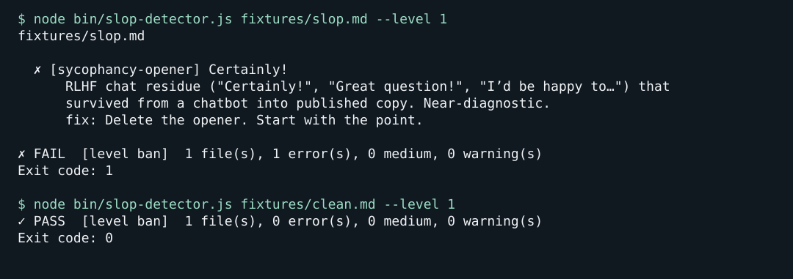

# ai-slop-detector

An agent skill and optional command-line linter that help developers review prose, interfaces, and code comments for empty claims and distracting presentation.

This project combines editorial judgment with deterministic checks. It does not require scans after every edit or ban certain styles unconditionally: necessary safety comments and intentional native UI fonts should remain acceptable during review.



The image shows actual output from the synthetic fixtures below. Regenerate it
with `python3 docs/render-demo.py > assets/demo.svg` (Python 3 and Node required).

## Quick start

Requires Node.js 20+ and Git. No dependency installation is needed for a local scan.

```bash
git clone https://github.com/asabirov/ai-slop-detector-skill.git
cd ai-slop-detector-skill
node bin/slop-detector.js fixtures/slop.md --level 1
node bin/slop-detector.js fixtures/clean.md --level 1
```

The first scan reports `sycophancy-opener` and exits **1**. That failure is expected:
it catches a chatbot greeting in the sample. The second scan reports `PASS` and
exits **0**. Replace the fixture path with a file or directory to scan your work.

The CLI is **not published to npm**. The public registry returned 404 for
`@apliteni/slop-detector` on 2026-09-23. Run from this clone or use the GitHub-based `npx` commands under [Running it](#running-it).

## Why it exists

AI-assisted drafts can keep chatbot greetings, vague claims, and comments that simply describe the code. The skill identifies specific problems in a finished artifact. The optional CLI finds repeatable patterns across files and provides stable exit codes for CI. Neither tool can prove who wrote the work.

## Install, update, roll back, and remove

Install the tagged skill for Claude Code and Codex with:

```bash
DO_NOT_TRACK=1 npx skills add https://github.com/asabirov/ai-slop-detector-skill/tree/v2.3.1 --skill ai-slop-detector --agent claude-code codex --global
```

`DO_NOT_TRACK=1` tells the skills CLI not to send telemetry. The `npx skills`
installer requires Node.js/npm and Git. It puts the skill in
`~/.agents/skills/ai-slop-detector`, where Codex reads it, and links it into
`~/.claude/skills` for Claude Code.

The skill itself needs nothing else. The optional CLI needs Node.js 20+ and
comes with the install, so you can run it from there:

```bash
node ~/.agents/skills/ai-slop-detector/bin/slop-detector.js <path>
```

Update to a later release tag with the same command and its new tag. Roll back
by rerunning it with the previous release tag. The newest tag is on the
[releases page](https://github.com/asabirov/ai-slop-detector-skill/releases).
Remove it with:

```bash
DO_NOT_TRACK=1 npx skills remove ai-slop-detector --agent claude-code codex --global
```

If you prefer not to use `npx skills`, clone the repository at the `v2.3.1` release tag into your agent's skills folder as `ai-slop-detector`. To update or roll back, run `git fetch --tags` in that folder and check out another release tag; to remove it, delete the folder.

Versions are the `vX.Y.Z` release tags that the release workflow creates; the skill has no version field of its own.
After each release the same workflow opens a pull request that renames every tag in this file to the newest release,
because `main` takes no push. Until the owner merges it, the tags here name the last release whose pull request was
merged. The workflow retries on the next merge to `main`, so a release whose pull request never opened is not lost.

## Using the skill

The skill's description asks
the agent to review PR bodies, issues, UI copy, documents, and code comments
before delivery, without waiting for an explicit request. You can also ask it
to “check this README for AI slop”. The skill makes one focused pass and reports
the passage, the reader's problem and a specific correction. It preserves useful technical
detail and does not rewrite for readability; use a separate editing pass for that.

The editorial UI checks cover headline full stops, middot separators, repeated
qualification badges, unhelpful implementation captions, a heading repeating
the value a control shows as chosen, the same fact stated twice, an
explanation wrapped around a changing number, a footnote under a table, a lede or
subtitle beside the heading that names one, and tooltip text set as its own line, in rendered pages and interface copy files. They preserve necessary
disclosures and useful user
information. Component style mismatches need a rendered comparison and can be
routed to design-review. These are agent review instructions, not additional
CLI rules.

For unclear marketing lines, the skill can run a fresh-reader check
(see [SKILL.md](SKILL.md)); the CLI does not.

Read [SKILL.md](SKILL.md) for the workflow. The skill does not automatically run a
command, install dependencies or review untouched files. Use the CLI when
requested, required by the repository or useful for a batch scan. Editorial
judgment does not waive an existing CI gate.

## What it does today

Three rule packs over one engine.

- **Visual** reads markup and the CSS a page applies, including stylesheets it
  links from disk. Catches fake protocol URIs, monospace used as decoration,
  emoji headings, gradients, glow shadows, glass surfaces, nested cards,
  oversized stats, motion and repeated layout defaults. It also reads position:
  an explanatory line under a table or a chart — the basis of the numbers, what
  they exclude, where they came from, or an "as of" date — fails at level 1,
  whether or not a local design rule asks for the line — and so does a lede, group
  subtitle or "as of" line set beside the heading that names it. A component counts
  as a table: `<DataTable/>` and `<LineChart/>` are what a screen actually ships.
  Native font stacks, numeric table data, a count line, a chart legend, a caption
  naming its figure, and a total, unit, byline or control beside a heading are
  allowed.
- **Text** reads visible prose plus the attributes a person actually reads
  (`title`, `alt`, `placeholder`, `aria-label`, `data-tip`, the meta
  description). Catches "not just X, but Y", hedge openers, sycophancy residue,
  clustered inflated vocabulary.
- **Comments** reads source files. Catches the design document an agent files
  into a code comment because the project gave it nowhere else to write one.
  `comment-chaptered` joins blocks separated by exactly one blank line, with
  no code between them: 8+ comment lines require two headings or interior
  dividers in total to fail level 1. A block of 8+ lines with one signal
  still fails on its own, even inside a joined run.
  One title in a joined run is a label; two chapter signals make chapters.
  Blank separators do not count toward length; individual block frames stay
  exempt. Essay and ratio measurements are unchanged.

Code is not prose. Fenced blocks and inline code spans come out of a document
before the rules that judge decoration read it, so a page can quote the pattern
it explains. Spans are matched the way CommonMark matches them, a run of N
backticks closing only on a run of N, and the HTML sniff is taken after that
removal so a markdown file naming `<style>` in backticks is still markdown.

Four levels, each a superset of the one below: `ban`, `recommended` (default),
`strict`, `paranoid`. Only `error` findings exit non-zero, so level 1 is the
merge gate and the higher levels are polish.

[The CLI reference](docs/ai-slop-detector.md) documents coverage and thresholds.
[SKILL.md](SKILL.md) is the personal skill entrypoint.

## Running it

In a repository's CI, or anywhere with Node 20:

```bash
REPO=github:asabirov/ai-slop-detector-skill
npx -y "$REPO#v2.3.1" dist --level 1        # pin a tag in CI
npx -y "$REPO#v2.3.1" src scripts --level 1
npx -y "$REPO" 'src/**/*.js' --json         # unpinned tracks main
```

There is no npm package. `npx` installs from this repository, so a runner needs
network and access to GitHub. Pin a tag: unpinned tracks `main`, and a rule that
tightens will fail a build that passed yesterday. The tag above is the one the
release workflow last put here, which lags while its pull request waits; the
newest is on the [releases page](https://github.com/asabirov/ai-slop-detector-skill/releases).

In this repository:

```bash
npm test           # the unit tests, the fixtures, and this repo's own prose
npm run lint:self  # the detector must pass its own rules
npm run verify     # both, in that order — the one script CI runs
```

`main` requires a `test` check, and that check runs `npm run verify`, so a pull
request whose unit tests fail cannot merge. The release workflow reports its own
`test` status on the README branch it opens, from the same script, so the two
mean the same thing. Paste the full `npm run verify` output into the PR anyway:
the check says pass or fail and nothing about which assertions ran. CodeQL runs
alongside it.

Every test has a budget — its own `{ timeout: ms }` or the module's default —
and the suites take `test`, `it` and `describe` from `scripts/lib/budget.js`,
which times each body on top of the timeout it hands to `node:test`. Without
that a synchronous test runs as long as it likes: a timeout cannot interrupt
code that never yields the thread.

JavaScript and TypeScript source files skip visual rules by default. Text output
reports how many files skipped them, including in mixed scans; JSON marks each
file with `visualRulesSkipped`. Rerun UI copy with `--as artifact` to include
those checks; code is then read as prose,
which can produce false positives. CSS and component files such as `.tsx`
already receive visual checks and do not get the skip notice.

The UI rules use static markup and declaration heuristics rather than a browser
or CSS engine: no runtime dependencies, fast batch scans, and no computed-style
claims. They read standalone CSS, inline styles, and literal Tailwind classes in
HTML, JSX, TSX, Vue, Svelte, and Astro. Dynamic classes, Tailwind configuration,
CSS cascade resolution, and contrast checks need a rendered review. See the
[CLI reference](docs/ai-slop-detector.md) for coverage and thresholds.

## Changing a rule

The rule set is a shared contract. Do not fork it, and do not silence a rule in
the repository that trips over it. Open an issue here naming the rule `id`,
showing the case, and saying what you would change.

A rule change is tested both ways: a triggering case goes into a slop fixture,
and every `fixtures/clean.*` must stay silent at paranoid. If a new rule makes a
clean fixture fire, the rule is wrong, not the fixture.

## License

[MIT](LICENSE).
